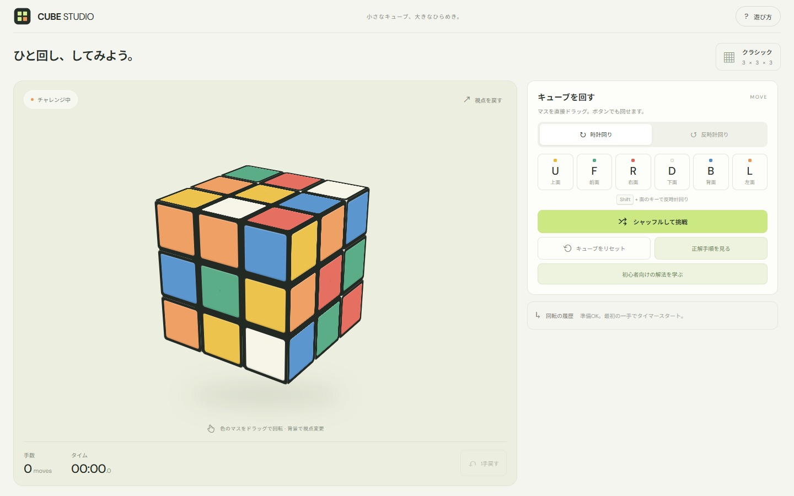

# ルービックキューブ — CUBE STUDIO

[ここから遊べます](https://bytecraft-jp.github.io/cube/)

**このフォルダーの `index.html` をブラウザで開くだけで遊べます。**

色のマスをドラッグすると、その方向に列が回ります。指を離すと90°にそろい、短いドラッグでは元に戻ります。中央の列も回転できます。キューブの外の背景をドラッグして視点を変更します。

面のボタンまたは U / D / F / B / R / L キーでも回転します。Shift で反時計回り、Ctrl / Command + Z で1手戻せます。「シャッフルして挑戦」で始めてください。

スマートフォン向けの画面、手数、タイマー、リセット、遊び方を備えています。アプリにインストールやサーバーは不要です。

PCではキューブが左側、操作と説明が右側に表示されます。スマートフォンではキューブを上に固定します。説明をスクロールしても、キューブと手順の「次の1手」ボタンは画面内に残ります。

「正解手順を見る」で、現在の状態から完成までの回転順を確認できます。「次の1手を回す」で1手ずつ実行できます。手順はシャッフルと操作を逆にたどる方法で、最短手順ではありません。途中でドラッグしたり1手戻したりすると手順も更新されます。

「初心者向けの解法を学ぶ」では、白のクロス → 白の1段目 → 中段 → 黄色のクロス → 黄色のエッジの位置 → 黄色の角の位置 → 角の向き、の7段階を図と基本手順で学べます。「この状態の手順を作る」で現在の配置から層ごとにそろえる手順を計算し、「解法の次の1手」で試せます。計算にはシャッフルの履歴を使いません。

ソースと操作の詳細は `cube-app` にあります。ソース編集後は `node cube-app/build.cjs` で単一HTMLを更新、`node cube-app/verify.cjs` でキューブの動作、`node cube-app/verify-beginner.cjs` で一般解法を検証できます。
